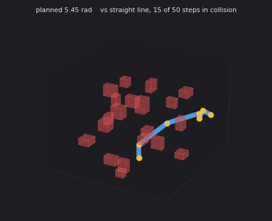

# UR5e Kinematics and Motion Planning

Forward and inverse kinematics, collision checking and a sampling-based motion
planner for a 6-DOF arm, written from the transformation matrices up. No
MoveIt, no OMPL, no kinematics library. The point of the project is the
mathematics, and the point of the mathematics is the two measurements below.



A planned motion through 20 obstacles. Blue is the arm, yellow the joint
origins, and each thin line is the path traced by one joint origin, elbow in
blue through to the tool in green.

The query shown is one the straight-line baseline fails: interpolating directly
puts 15 of its 50 steps in collision, 4.5 cm deep at the worst point.

Tracing every joint rather than only the tool is what makes the avoidance
visible. The tool sweeps a clean arc well above the clutter while the elbow
dips and curls underneath it, and the elbow is the link the obstacles actually
threaten.

## Why write the kinematics by hand

A closed-form inverse kinematics solver and a numerical one both return joint
angles for a requested pose. Choosing between them is usually done by habit.
The interesting version of the question is what each one costs and where each
one fails, which is answerable by measurement.

## Kinematic model

Standard Denavit-Hartenberg parameters for the UR5e:

| i | d (m) | a (m) | alpha |
|---|---|---|---|
| 1 | 0.1625 | 0 | pi/2 |
| 2 | 0 | -0.425 | 0 |
| 3 | 0 | -0.3922 | 0 |
| 4 | 0.1333 | 0 | pi/2 |
| 5 | 0.0997 | 0 | -pi/2 |
| 6 | 0.0996 | 0 | 0 |

Each row becomes a homogeneous transform

```
      | cos t   -sin t cos al    sin t sin al   a cos t |
 iT = | sin t    cos t cos al   -cos t sin al   a sin t |
      |   0        sin al           cos al         d    |
      |   0          0                0            1    |
```

and the product of the six gives the tool pose. The geometric Jacobian is
assembled column by column from the joint axes,

```
 J_v(i) = z(i) x (p_end - p(i))
 J_w(i) = z(i)
```

which is also what the numerical solver and the singularity measures use.

**Verification.** The Jacobian is checked against finite differences of the
forward kinematics to within 5e-8, which is the truncation error of the
difference itself rather than a modelling error.

## Inverse kinematics

The closed-form solver follows the standard UR decomposition: joint 1 from the
position of the wrist centre, joint 5 from the tool position projected onto the
shoulder plane, joint 6 from the tool orientation, then joints 2, 3 and 4 from
the planar two-link subproblem that remains. Two branches at each of three
stages give up to **eight solutions** per pose.

The numerical solver is damped least squares on the same Jacobian,

```
 dq = J' (J J' + lambda^2 I)^-1 e
```

with lambda = 0.05, a step cap of 0.4 rad and a seed drawn 0.5 rad away from the
true configuration.

### Measured, 3000 random reachable poses

| | closed form | damped least squares |
|---|---|---|
| Success rate | **100.0%** | 92.9% |
| Median time | 0.414 ms | 2.748 ms |
| 95th percentile time | 0.848 ms | 47.7 ms |
| Median position error | 1.0e-16 m | 6.3e-05 m |
| Solutions returned | 7.16 | 1 |

Absolute times are machine dependent; the ratios are not, and they hold across
every machine this was run on.

Two results are worth stating plainly.

**The tail, not the median, is the real cost.** The numerical solver is 6.6x
slower at the median and **56x slower at the 95th percentile**, because a hard
pose means iterating to the cap rather than converging. A median figure hides
exactly the cases a real controller has to meet a deadline on.

**Failures are concentrated at singularities.** Split by manipulability, the
measure `sqrt(det(J J'))`:

| Manipulability quartile | closed form | damped least squares |
|---|---|---|
| 0.0000 - 0.0037 (near singular) | 100% | **77.2%** |
| 0.0037 - 0.0146 | 100% | 98.0% |
| 0.0146 - 0.0375 | 100% | 97.9% |
| 0.0375 - 0.1160 (well conditioned) | 100% | 98.5% |

Near a singularity the numerical solver misses roughly **one pose in four**,
while the closed form does not degrade at all. It solves the geometry rather
than descending a gradient, so a rank-deficient Jacobian is not its problem.
Away from singularities the two are within a point and a half of each other.

The practical reading: damping handles a badly conditioned Jacobian well enough
to keep the solver stable, but not well enough to keep it converging, and the
quartile where that matters is a quarter of the workspace.

Returning eight solutions rather than one is the other difference that shows up
in use. Picking the branch nearest the current configuration avoids the
elbow flip that a single-solution solver has no way to see coming.

## Collision model

Links are capsules, a segment between consecutive joint origins with a radius,
sampled at ten points each. Obstacles are axis-aligned boxes, and the
distance from a point to a box is exact. The floor is a half-space, with the
base column exempt since it is bolted to it.

Distances to every obstacle are evaluated as one array operation rather than a
loop, which keeps a full configuration check under a millisecond and is what
makes several thousand of them per query affordable.

## Motion planning

Bidirectional RRTConnect in joint space: two trees, alternating extend and
connect, 0.35 rad steps, edges validated at 0.05 rad resolution. Successful
paths are post-processed by random shortcutting, 120 attempts at replacing a
subpath with a straight segment.

The baseline is straight-line interpolation in joint space, which is what you get
if you skip planning entirely.

### Measured, 40 planning queries per density

| Obstacles | RRTConnect | straight line | plan | shortcut | iterations | joint path | tool path | shortcut saves |
|---|---|---|---|---|---|---|---|---|
| 0 | 95% | 95% | 27 ms | 72 ms | 1 | 5.83 rad | 0.64 m | 4% |
| 10 | 95% | 45% | 68 ms | 586 ms | 3 | 6.29 rad | 0.86 m | 12% |
| 20 | 90% | 18% | 191 ms | 1465 ms | 28 | 6.71 rad | 1.19 m | 20% |
| 40 | 95% | 20% | 342 ms | 1262 ms | 52 | 6.95 rad | 1.03 m | 20% |

**Planning is what makes the arm usable, and it is cheap.** The straight-line
baseline collapses from 95% to 18% once the workspace has 20 obstacles in it,
while RRTConnect holds at 90% or above throughout. The cost of that is 191 ms.

**Smoothing costs more than planning, nearly 8x more.** At 20 obstacles the
tree is found in 191 ms and then 1465 ms goes into shortcutting it. The
shortcutter runs 120 collision-checked segment queries over a path that is
already valid, and each query is longer than the edges the planner checked.
Whether that trade is worth it depends on the application: it buys a 20%
shorter joint path, which matters for a cycle repeated thousands of times and
does not matter for a one-off motion.

**Empty is not easy.** At zero obstacles the 5% failures are the floor, not
clutter. With joint limits at plus or minus pi, a large part of the
configuration space puts the wrist under the table.

**Avoiding an obstacle is almost free, which is why it does not look like
anything.** For the query in the animation the straight-line motion penetrates
4.5 cm into a box, while the planned one clears everything by 4 mm. The cost of
that difference is **2% of joint-space path length.** A few degrees at the
shoulder sweep the forearm through tens of centimetres, so the detour needed to
clear an obstacle is tiny in the space the planner searches and invisible in
the space you watch. It also means the margin is thin: 4 mm of clearance is
what the planner considers a solved problem, and a real arm would want a
padding term rather than the raw geometry.

## ROS 2

The same plan runs as a ROS 2 node publishing joint states, TF for all six link
frames, the obstacles and one traced path per joint.


Details and parameters in [ros2/README.md](ros2/README.md).

## Layout

```
armlab/
  model.py      DH parameters, transforms, forward kinematics, Jacobian
  ik.py         closed-form and damped least squares inverse kinematics
  collision.py  capsule links, box obstacles, configuration and edge checks
  planner.py    RRTConnect, shortcutting, straight-line baseline
scripts/
  benchmark_ik.py       closed form against damped least squares
  benchmark_planner.py  planner against the straight-line baseline
  render.py             animation of a planned motion
tests/
  test_kinematics.py    21 tests covering both modules
  test_planning.py
ros2/armlab_ros/        ROS 2 node, launch file and RViz config
```

## Running

```
pip install -r requirements.txt
python scripts/benchmark_ik.py --samples 3000
python scripts/benchmark_planner.py --runs 40
python scripts/render.py --obstacles 20 --seed 3
```

Tests:

```
pip install pytest
pytest
```

## Limitations

Capsules are a coarse link model. A real UR5e has a shoulder and a wrist that
are wider than the forearm, so the single radius per link is conservative in
places and optimistic in others. Self-collision is not checked at all, which is
the more serious of the two omissions.

Segment-to-box distance is approximated by sampling ten points along each link
rather than solved exactly, so a thin obstacle could in principle pass between
two samples. At the link lengths and obstacle sizes used here the spacing is
about 4 cm against a minimum obstacle dimension of 6 cm.

Joint limits are set to plus or minus pi rather than the plus or minus 2 pi the
hardware allows. The real range makes every pose reachable in several wrapped
configurations, which inflates the search space without adding solutions.

Dynamics are not modelled. The planner produces a geometric path, not a
trajectory: no velocity or acceleration limits, no torque, no time
parameterisation. The reported times are planning times, not motion times.

