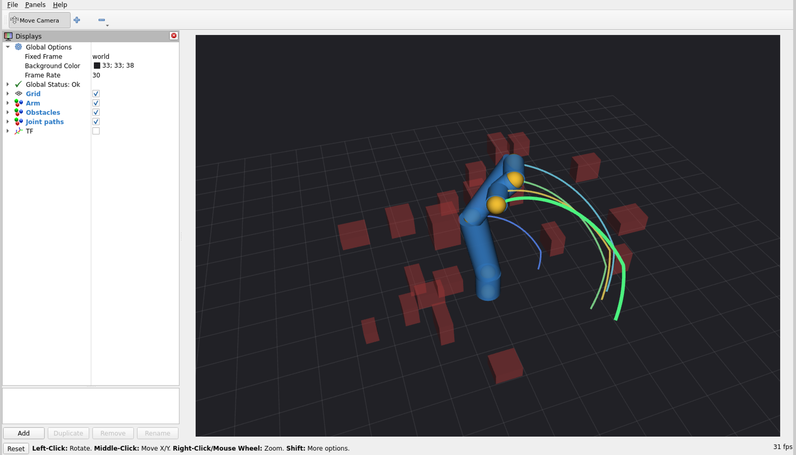

# ROS 2 interface

Plans a motion with the `armlab` library and animates it in RViz. The
kinematics, collision checking and planning are unchanged. This only exposes
the result over standard interfaces.



Each coloured line is the path of one joint origin. The wrist and tool sweep a
wide arc clear of everything, while the elbow, the short blue curve close to
the arm, stays low and tucks under the obstacles. The elbow is the link the
clutter actually threatens, which is not visible if only the tool is traced.

## Topics

| Topic | Type | |
|---|---|---|
| `~/arm` | `visualization_msgs/MarkerArray` | link capsules and joint origins |
| `~/obstacles` | `visualization_msgs/MarkerArray` | the box obstacles |
| `~/joint_paths` | `visualization_msgs/MarkerArray` | path traced by each joint origin |
| `~/joint_states` | `sensor_msgs/JointState` | the six joint angles |

Frames `link_1` to `link_6` are broadcast on TF from the same forward
kinematics the planner uses, so the transform tree and the markers cannot drift
apart.

The arm is drawn from markers rather than a URDF, so the package has no
dependency on `ur_description` and nothing needs to be downloaded.

## Parameters

| | default | |
|---|---|---|
| `obstacles` | 20 | how many boxes to scatter |
| `seed` | 0 | scene, start and goal |
| `speed` | 0.6 | rad/s along the planned path |
| `rate_hz` | 30.0 | publish rate |
| `frame_id` | world | |

The node plans once at startup and then loops the animation. If no plan is
found it exits with an error rather than publishing an empty scene. Try
another seed.

## Build and run

From a workspace root:

```
git clone https://github.com/dumitrubogdan03/ur5e-motion-planning.git src/ur5e-motion-planning
ln -s $PWD/src/ur5e-motion-planning/ros2/armlab_ros src/armlab_ros
export PYTHONPATH=$PWD/src/ur5e-motion-planning:$PYTHONPATH

colcon build --packages-select armlab_ros
source install/setup.bash

ros2 launch armlab_ros plan.launch.py obstacles:=20 seed:=3
```

RViz opens with the arm, the obstacles and one traced path per joint, each in
its own namespace so they can be toggled individually. The arm runs the planned
motion back and forth rather than jumping to the start on each repeat.

Without RViz:

```
ros2 run armlab_ros plan_node --ros-args -p obstacles:=40
ros2 topic echo /armlab_plan/joint_states
```

The launch line printed at startup reports the planning time, the iteration
count and the joint-space path length before and after shortcutting.
